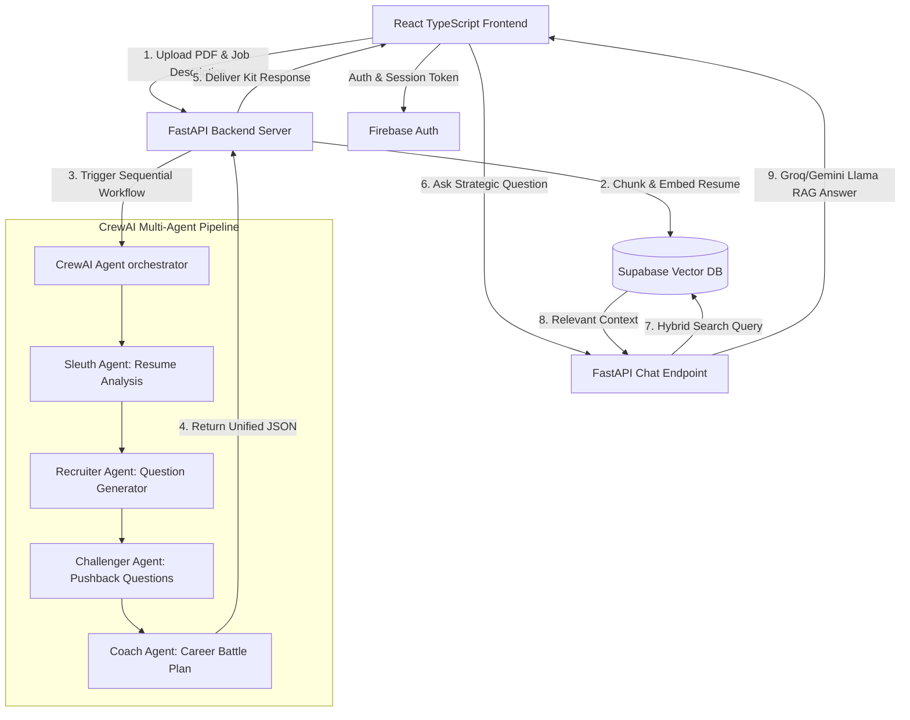
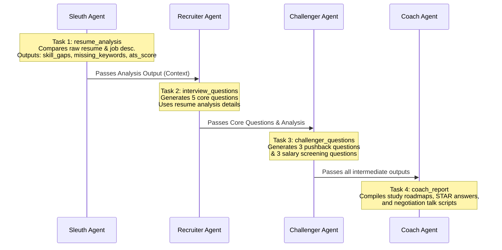

# System Architecture & Multi-Agent Design Specification

This document details the system design, data flow, database schemas, and the multi-agent pipeline powering the **Career Command Center (CCC)**.

---

## 🏗️ High-Level System Architecture

The CCC uses a decoupled client-server architecture with a RAG-enabled database layer and Firebase Auth.



---

## 🤖 CrewAI Agents & Task Pipelines

The core matching engine is built using **CrewAI**'s sequential task orchestrator. The pipeline consists of 4 specialized AI agents working in a structured sequence:

| Agent Key | Role Name | Agent Objective | Backstory |
| :--- | :--- | :--- | :--- |
| **Sleuth** | Resume Intelligence Specialist | Compare candidate resume and job description to identify strengths, missing keywords, and ATS match score. | Expert recruiter specializing in technical hiring and automated screening tools. |
| **Recruiter** | Hiring Manager Simulator | Generate exactly 5 realistic, role-specific questions (2 technical, 2 behavioral, 1 situational situation). | Senior engineering director experienced in candidate interviews. |
| **Challenger** | Stress Interview Specialist | Generate exactly 3 tough pushback questions targeting candidates' weak areas, and exactly 3 salary screening questions. | Tough but fair interviewer skilled in identifying gaps in experience. |
| **Coach** | Career Strategy Coach | Compile all outputs into a structured, markdown-formatted study roadmap and action battle plan. | Elite career coach for high-performing candidates. |

### Tasks Execution Order & Context Routing



---

## 🗄️ Database Schema & RAG Retrieval Flow

In **Login Mode**, the application performs a Hybrid Retrieval-Augmented Generation (RAG) indexing workflow to enable real-time chat context.

### Database Tables (Supabase PostgreSQL + pgvector)

#### 1. `resumes` Table
Stores uploaded resume documents.
```sql
CREATE TABLE resumes (
    id UUID PRIMARY KEY DEFAULT gen_random_uuid(),
    user_id TEXT NOT NULL,
    filename TEXT NOT NULL,
    raw_text TEXT NOT NULL,
    summary TEXT,
    created_at TIMESTAMP WITH TIME ZONE DEFAULT timezone('utc'::text, now()) NOT NULL
);
```

#### 2. `resume_embeddings` Table
Stores individual chunks of resumes along with their vector embeddings for similarity lookup.
```sql
CREATE TABLE resume_embeddings (
    id UUID PRIMARY KEY DEFAULT gen_random_uuid(),
    resume_id UUID REFERENCES resumes(id) ON DELETE CASCADE,
    chunk_text TEXT NOT NULL,
    embedding VECTOR(768), -- Leverages Google text-embedding-004
    created_at TIMESTAMP WITH TIME ZONE DEFAULT timezone('utc'::text, now()) NOT NULL
);
```

#### 3. `prep_kits` Table
Caches the compiled multi-agent reports for high-speed retrieval on page refresh.
```sql
CREATE TABLE prep_kits (
    id UUID PRIMARY KEY DEFAULT gen_random_uuid(),
    user_id TEXT NOT NULL,
    resume_id UUID REFERENCES resumes(id) ON DELETE CASCADE,
    filename TEXT NOT NULL,
    job_description TEXT NOT NULL,
    prep_kit_data JSONB NOT NULL,
    created_at TIMESTAMP WITH TIME ZONE DEFAULT timezone('utc'::text, now()) NOT NULL
);
```

---

## 💬 RAG Chat Retrieval Protocol

When a candidate inputs a query in the **AI Mentor Chat**:
1. The backend routes the query to generate a 768-dimensional search vector using `gemini/text-embedding-004`.
2. A PostgreSQL hybrid function runs **Cosine Similarity + Full-Text Search (FTS)** against the candidate's active `resume_id` chunks.
3. The closest 4 matching chunks are loaded into the chat context.
4. The conversational prompt (including session history and RAG chunks) is sent to Gemini (with automatic fallback to Groq Llama models if API errors occur) to deliver a highly context-aware answer.
