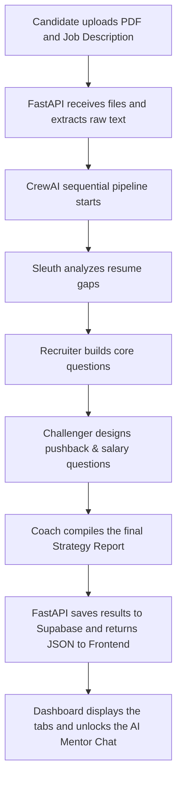

# Career Command Center — System Flow & Architecture Specification

This document provides a conceptual walkthrough of the system flow, the multi-agent orchestration, and the database design that powers the **Career Command Center (CCC)**.

---

## 📐 Conceptual System Architecture

The application is structured into three integrated layers:

1. **User Dashboard (Client Layer)**: Provides an interface for uploading resumes, entering target job descriptions, reviewing structured tabs (match scores, questions, outreach letters), and chatting with the AI Mentor.
2. **Intelligence Engine (Application Layer)**: A FastAPI server that hosts the business logic, parses text, and runs the CrewAI multi-agent sequence.
3. **Knowledge Storage (Database & Auth Layer)**: Manages secure user authentication via Firebase and stores document embeddings in a Supabase vector database to power the semantic chatbot.

---

## 🤖 Multi-Agent Pipeline & Collaboration Flow

The core analysis is performed by a team of **four specialized AI agents** configured using the CrewAI framework. Instead of working in isolation, these agents execute tasks sequentially, passing their intermediate findings to the next agent in line to refine and expand the final preparation kit.

### The Agent Team
- **Resume Intelligence Specialist (Sleuth)**: This agent performs the initial screening. It contrasts the raw text of the candidate's resume with the requirements of the job description to find missing key qualifications, calculate a match score, and highlight technical gaps.
- **Hiring Manager Simulator (Recruiter)**: Using the initial analysis from the Sleuth, this agent steps into the shoes of an interviewer. It formulates a realistic interview plan consisting of core technical questions, behavioral STAR prompts, and situational day-one challenges.
- **Stress Interview Specialist (Challenger)**: This agent focuses on stress testing. It generates tough pushback questions targeting gaps in the resume (such as employment gaps, tool pivots, or lack of listed framework expertise) and scripts salary screening scenarios.
- **Career Strategy Coach (Coach)**: The final compiler of the team. It synthesizes all generated questions, gaps, and pushback points into a detailed, markdown-formatted study roadmap, candidate STAR framework answers, and reframing guides.

---

## 🔄 End-to-End Data Flow

The system flows through a series of steps to compile and deliver the prep kit:

---

## 🗄️ Database Strategy & Retrieval-Augmented Generation (RAG)

To enable the interactive AI Mentor Chat, the system uses a vector database indexing process:

### 1. Document Indexing (Preprocessing)
When a resume is processed, its text is divided into small, overlapping semantic chunks. Each chunk is passed to an embedding service to generate a high-dimensional vector representing the meaning of the text. These chunks and vectors are stored in a dedicated database table connected to the user's account.

### 2. Semantic Search (Retrieval)
When a user asks a question in the chat (e.g., *"How should I explain my lack of Java experience?"*):
- The chat query is converted into a vector representation.
- A hybrid search function compares this query vector against the candidate's stored resume chunks using cosine similarity and keyword matching.
- The top-ranking chunks are retrieved as relevant context.

### 3. Contextual Response Generation
The retrieved chunks, the conversation history, and the user's query are combined into a system prompt. This prompt is sent to the LLM, giving the mentor access to the candidate's background details to answer the query accurately.

---

## 🛡️ Resilience & High Availability (LLM Fallbacks)

To ensure the application remains operational during third-party API outrages or regional model deprecations:
- **Primary Endpoint**: Chat and RAG queries are routed through Google's Gemini models.
- **Failover Route**: If the Gemini API returns connection errors, model-not-found warnings, or rate limits, the FastAPI backend catches the exception and redirects the query to Groq's Llama models.
- This transition is completed in milliseconds, ensuring a seamless user experience.
