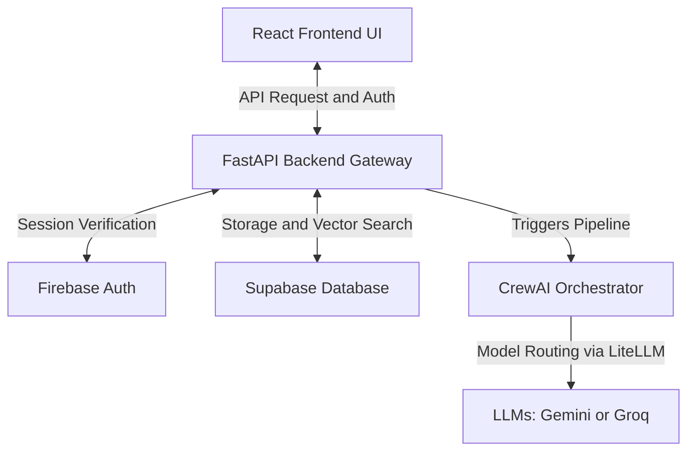
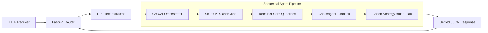
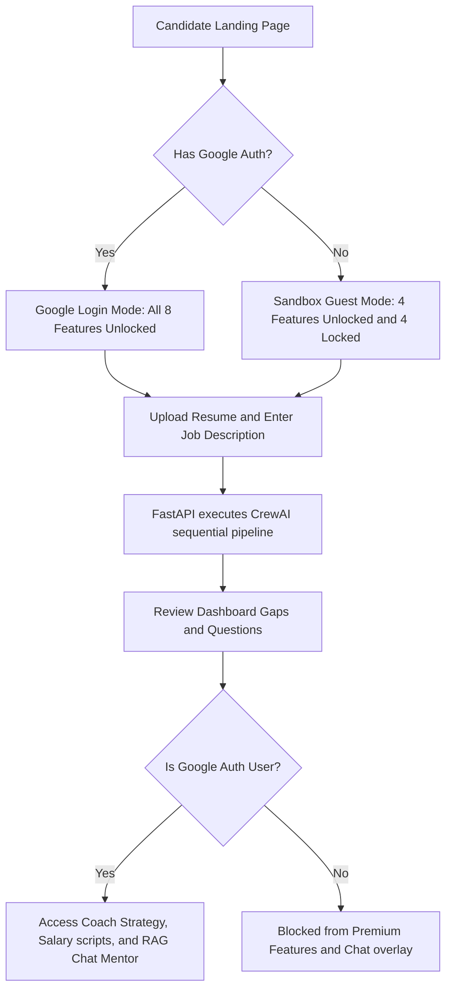

# Career Command Center — System Diagrams Reference

This document compiles the simplified, clean, and crisp Mermaid architecture diagrams and process flows that represent the design of the **Career Command Center (CCC)** application. It also provides copy-pasteable prompts to generate professional visual diagrams in **Eraser.io**.

---

## 1. System Architecture Diagram

This diagram maps the high-level system boundaries and integrations.



---

## 2. Backend Architecture Diagram

This diagram zooms into the FastAPI backend server, detailing the API layers and the sequential agent workflow.



---

## 3. RAG Architecture Diagram

This diagram details the dual RAG Ingestion (PDF index upload) and Retrieval (AI Chat query) flows.

```mermaid
graph TD
    subgraph ingestion ["1. Ingestion Flow: PDF Upload"]
        A["Resume PDF"] --> B["Text Chunking"]
        B --> C["768-Dimensional Vector Embeddings"]
        C --> D["Store in Supabase pgvector"]
    end

    subgraph retrieval ["2. Retrieval Flow: AI Chat"]
        E["User Question"] --> F["Generate Query Vector"]
        F --> G["Cosine Similarity Search"]
        G --> H["Inject Matching Chunks to Prompt"]
        H --> I["LLM Completion: Gemini or Groq"]
        I --> J["Deliver AI Chat Response"]
    end
```



---

## 4. User Flow Architecture Diagram

This diagram tracks the candidate journey from landing page to dashboard interaction based on authentication status.



---

## 🎨 Eraser.io Diagram Code Prompts

Copy and paste the code blocks below into **Eraser.io**'s diagram-as-code editor to generate high-resolution, professional architecture diagrams.

### System Architecture Code
```text
// System Architecture
ReactFrontend [icon: react, label: "React Frontend UI"]
FastAPIGateway [icon: fastapi, label: "FastAPI Backend Gateway"]
FirebaseAuth [icon: firebase, label: "Firebase Auth"]
SupabaseDB [icon: database, label: "Supabase Database"]
CrewAIOrchestrator [icon: python, label: "CrewAI Orchestrator"]
LLMProviders [icon: openai, label: "LLMs: Gemini / Groq"]

ReactFrontend > FastAPIGateway: "API Requests & Auth"
FastAPIGateway > FirebaseAuth: "Session Verification"
FastAPIGateway > SupabaseDB: "RAG search & cache storage"
FastAPIGateway > CrewAIOrchestrator: "Trigger sequential agents"
CrewAIOrchestrator > LLMProviders: "Route models via LiteLLM"
```

### Backend Architecture Code
```text
// Backend Architecture
HTTPRequest [icon: check, label: "HTTP Request"]
FastAPIRouter [icon: fastapi, label: "FastAPI Router"]
PDFExtractor [icon: document, label: "PDF Text Extractor"]
CrewAIOrchestrator [icon: python, label: "CrewAI Orchestrator"]

subgraph agent_pipeline [label: "Sequential Agent Pipeline"]
  Sleuth [icon: search, label: "Sleuth: ATS & Gaps"]
  Recruiter [icon: user, label: "Recruiter: Core Questions"]
  Challenger [icon: shield, label: "Challenger: Pushback"]
  Coach [icon: compass, label: "Coach: Strategy Battle Plan"]
  
  Sleuth > Recruiter
  Recruiter > Challenger
  Challenger > Coach
end

HTTPRequest > FastAPIRouter
FastAPIRouter > PDFExtractor
PDFExtractor > CrewAIOrchestrator
CrewAIOrchestrator > Sleuth
Coach > FastAPIRouter: "Unified JSON response"
```

### RAG Architecture Code
```text
// RAG Architecture
subgraph ingestion_flow [label: "1. Ingestion Flow (PDF Upload)"]
  ResumePDF [icon: document, label: "Resume PDF"]
  Chunking [icon: grid, label: "Text Chunking"]
  Embeddings [icon: hash, label: "768-Dim Vector Embeddings"]
  SupabaseStorage [icon: database, label: "Supabase pgvector"]
  
  ResumePDF > Chunking > Embeddings > SupabaseStorage
end

subgraph retrieval_flow [label: "2. Retrieval Flow (AI Chat)"]
  UserQuestion [icon: message, label: "User Question"]
  QueryVector [icon: hash, label: "Generate Query Vector"]
  CosineSearch [icon: search, label: "Cosine Similarity Match"]
  ContextInjection [icon: plus, label: "Inject Chunks to Prompt"]
  LLMCompletion [icon: openai, label: "LLM: Gemini / Groq"]
  ChatReply [icon: check, label: "Deliver Chat Response"]
  
  UserQuestion > QueryVector > CosineSearch > ContextInjection > LLMCompletion > ChatReply
end

SupabaseStorage > CosineSearch: "Retrieve matching chunks"
```
