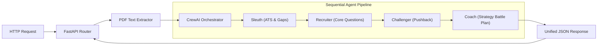

# Career Command Center — System Diagrams Reference

This document compiles the simplified, clean, and crisp Mermaid architecture diagrams and process flows that represent the design of the **Career Command Center (CCC)** application.

---

## 1. System Architecture Diagram

This diagram maps the high-level system boundaries and integrations.

```mermaid
graph TD
    A["React Frontend (UI Dashboard)"] <-->|API Request / Auth| B["FastAPI Backend (Gateway)"]
    B <-->|Session Verification| C["Firebase Auth"]
    B <-->|Storage & Vector search| D["Supabase Database"]
    B -->|Triggers Pipeline| E["CrewAI Orchestrator"]
    E -->|Model Routing (LiteLLM)| F["LLMs (Gemini / Groq)"]
```

---

## 2. Backend Architecture Diagram

This diagram zooms into the FastAPI backend server, detailing the API layers and the sequential agent workflow.



---

## 3. RAG Architecture Diagram

This diagram details the dual RAG Ingestion (PDF index upload) and Retrieval (AI Chat query) flows.

```mermaid
graph TD
    subgraph ingestion ["1. Ingestion Flow (PDF Upload)"]
        A["Resume PDF"] --> B["Text Chunking"]
        B --> C["Vector Embeddings (768-dim)"]
        C --> D["Store in Supabase pgvector"]
    end

    subgraph retrieval ["2. Retrieval Flow (AI Chat)"]
        E["User Question"] --> F["Generate Query Vector"]
        F --> G["Cosine Similarity Search"]
        G --> H["Inject Matching Chunks to Prompt"]
        H --> I["LLM Completion (Gemini / Groq)"]
        I --> J["Deliver AI Chat Response"]
    end
```



---

## 4. User Flow Architecture Diagram

This diagram tracks the candidate journey from landing page to dashboard interaction based on authentication status.


