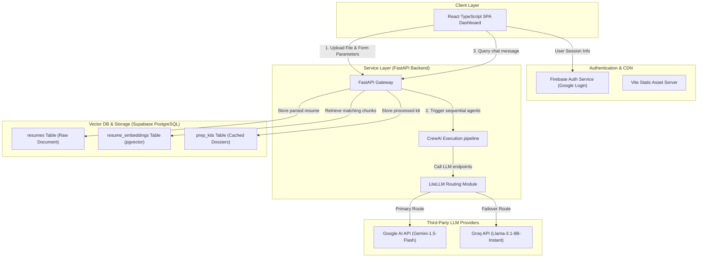
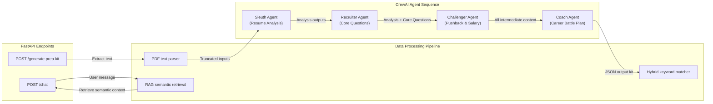
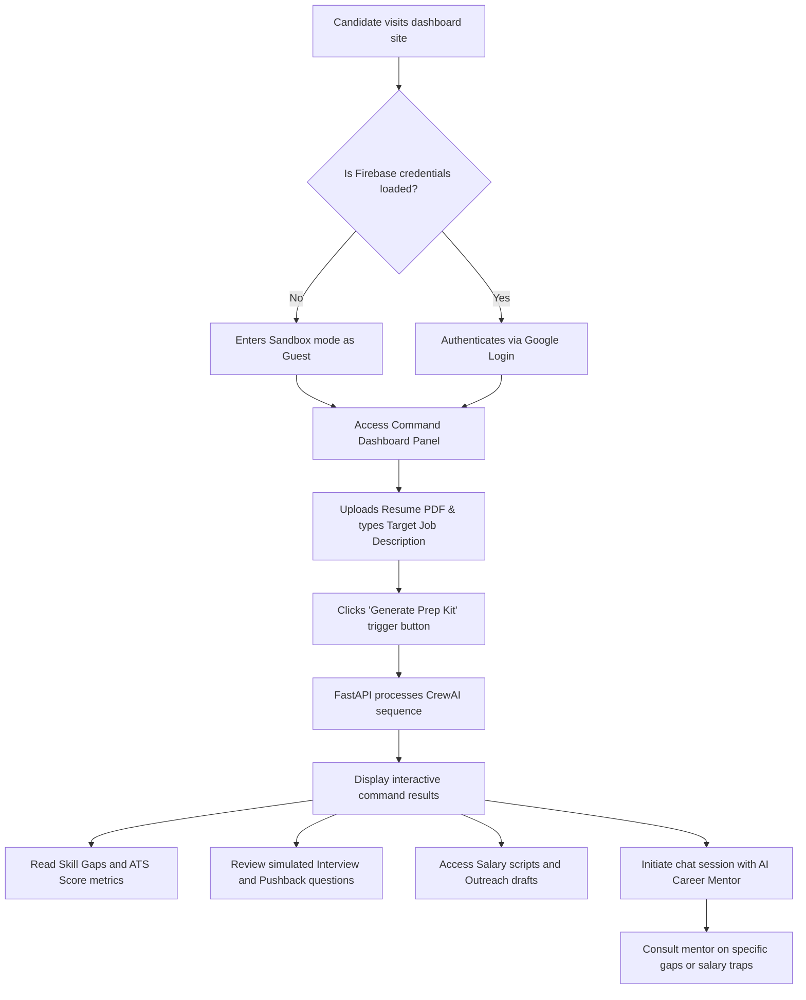

# Career Command Center — System Diagrams Reference

This document compiles the Mermaid architecture diagrams and process flows that represent the design of the **Career Command Center (CCC)** application.

---

## 1. System Architecture Diagram

This diagram maps the high-level boundaries between the user's browser, external cloud APIs, authentication services, and the backend engine.

---

## 2. Backend Architecture Diagram

This diagram zooms into the FastAPI backend server, illustrating the API router layers, business components, and the sequential CrewAI task pipeline.

---

## 3. RAG Architecture Diagram

This diagram details the dual RAG pipeline: **Ingestion Flow** (how the resume is split and indexed) and **Retrieval Flow** (how candidate queries are semantically matched and answered).

```mermaid
flowchart TD
    subgraph ingestion_flow ["Ingestion Flow (PDF Upload)"]
        A["Candidate Resume Uploaded"] --> B["FastAPI extracts raw string text"]
        B --> C["Text divided into overlapping chunks"]
        C --> D["Gemini embedding model generates 768-dim vectors"]
        D --> E["Store chunks and vector keys in Supabase postgres table"]
    end

    subgraph retrieval_flow ["Retrieval Flow (User Chat Query)"]
        F["Candidate inputs chat question"] --> G["Generate query vector embedding"]
        G --> H["PostgreSQL Cosine Similarity search matching user resume_id"]
        H --> I["Retrieve top 4 closest matching resume chunks"]
        I --> J["Assemble prompt with System Rules + RAG chunks + Message History"]
        J --> K["Gemini API generates chat response"]
        K -->|If API fails| L["Failover to Groq API Llama model"]
        L --> M["Deliver chat reply to client"]
        K --> M
    end
```

---

## 4. User Flow Architecture Diagram

This diagram tracks the step-by-step journey of a job candidate, showing how they navigate the application states from initial landing through dashboard analysis.

