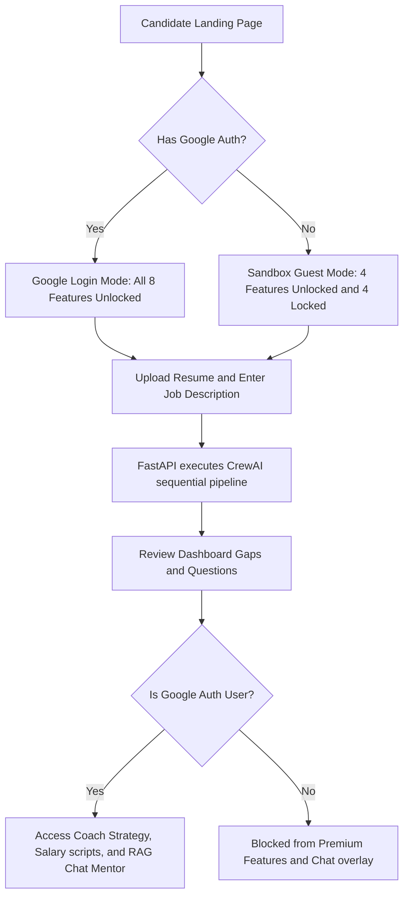

# Career Command Center — User Flow Diagram

This diagram tracks the candidate journey from the landing page through the dashboard, showing the authentication branching and which premium features are locked/unlocked.

